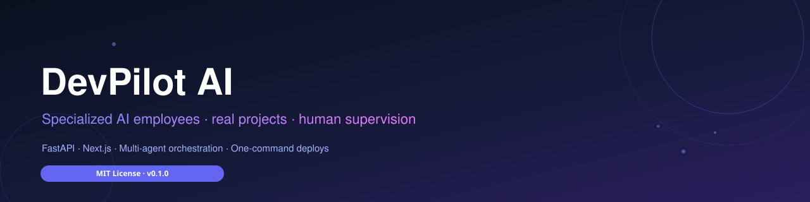

<div align="center">



**DevPilot AI — a multi-agent software studio where specialized AI employees plan, build, review and ship real projects — on your command, under human supervision.**

<br />

[](https://www.python.org/)
[](https://fastapi.tiangolo.com/)
[](https://www.sqlalchemy.org/)
[](https://nextjs.org/)
[](https://react.dev/)
[](https://www.typescriptlang.org/)
[](https://tailwindcss.com/)
[](https://prometheus.io/)
[](https://www.docker.com/)
[](LICENSE)

</div>

---

## Table of contents

- [✨ Features](#-features)
- [🤖 The crew](#-the-crew)
- [🔁 The pipeline](#-the-pipeline)
- [🧱 Tech stack](#-tech-stack)
- [🚀 Getting started](#-getting-started)
- [⚙️ Configuration](#️-configuration)
- [📁 Project structure](#-project-structure)
- [🧪 Development & testing](#-development--testing)
- [🌍 Deployment](#-deployment)
- [📚 API reference](#-api-reference)
- [📄 License](#-license)

---

## ✨ Features

| | Feature | Description |
|---:|---|---|
|  | **Orchestrated workflows** | Dispatch any set of agents in any order. The orchestrator sequences runs, streams live activity, recovers stale runs after restarts, and creates git checkpoints for safe rollback. |
|  | **Live activity streaming** | Watch every agent work in real time — reasoning, tool calls, successes and failures — in the dashboard and via the API. |
|  | **Persistent team memory** | Every decision, lesson, task and project milestone is pushed to short-term memory and consolidated into long-term memory — the team gets smarter with every run. |
|  | **Knowledge search** | A vector knowledge base lets agents search what was learned across projects before acting. |
|  | **Permission boundaries** | Every agent writes only inside its own workspace (`docs/`, `backend/`, `frontend/`, `deployment/`) — protected files like `.env` are off-limits. |
|  | **One-command deployments** | Provider-based deploys to AWS and Vercel with readiness checks, one-click approval gates, custom domains and live logs — plus templates for seven platforms. |
|  | **Observability & audit** | Prometheus metrics, structured logging, full audit trail, notifications and a rate-limited, header-security-hardened API. |
|  | **Git checkpoints** | Every stage is committed automatically so any workflow run can be rolled back safely. |

---

## 🤖 The crew

| | Agent | Responsibility | Writes to |
|---:|---|---|---|
|  | **Planner** | Researches the idea on the web, picks a justified tech stack and writes a complete implementation plan. | `docs/` |
|  | **Backend Engineer** | Implements APIs, data models, auth, background jobs and integrations — true to the plan's tech stack. | `backend/` |
|  | **Frontend Engineer** | Designs a distinctive visual identity and builds a polished, responsive, accessible UI. | `frontend/` |
|  | **DevOps Engineer** | Generates platform config, Dockerfiles, CI/CD and a step-by-step deployment plan. | `deployment/` |
|  | **Code Reviewer** | Audits the whole codebase for security flaws, bugs and risks; writes a severity-ranked report. Never modifies code. | `docs/` |

Each agent runs a shared, hardened loop: recall memory → search knowledge → consult the model → call tools → record lessons — with per-agent LLM routing, failure-resilient retries and a hard round budget.

---

## 🔁 The pipeline

<div align="center">

| <br/>**1 · Plan** | <br/>**2 · Build** | <br/>**3 · Review** | <br/>**4 · Ship** |
|---|---|---|---|
| Tell the Planner what to build. It researches, designs the architecture and breaks the work into tasks. | Backend and Frontend engineers implement the plan while the DevOps engineer prepares infrastructure. | The Reviewer audits every line. Failures loop back to the team (up to `MAX_REVIEW_RETRIES`) before anything ships. | You approve the deployment at the gate — then it goes live on the platform of your choice. |

</div>

---

## 🧱 Tech stack

### Backend — `agency/`

| Technology | Purpose |
|---|---|
|  Python 3.11+ / FastAPI | REST API, WebSocket-free streaming, OpenAPI docs at `/api/docs` |
|  SQLAlchemy 2 + Alembic | Async ORM and migrations (SQLite out of the box, PostgreSQL supported) |
|  Pydantic 2 + pydantic-settings | Type-safe schemas and env-driven configuration |
|  Prometheus + structlog | `/metrics` endpoint, structured logging, audit trail |
|  LLM provider adapters | OpenAI, Anthropic, Gemini, DeepSeek, Qwen (DashScope), Ollama — with per-agent routing via `AGENT_MODELS` |

### Frontend — `frontend/`

| Technology | Purpose |
|---|---|
|  Next.js 15 (App Router) + React 19 | Dashboard, server-side API proxy, motion-rich marketing pages |
|  TypeScript 5.7 | End-to-end typed API client |
|  Tailwind CSS 4 | Utility-first design system, dark/light themes |
|  Motion (Framer Motion) | Scroll scenes, 3D tilt cards, count-ups, micro-interactions |
|  TanStack Query + Lucide | Server-state cache, hooks, icon library |

---

## 🚀 Getting started

### Prerequisites

- Python **3.11+** and [uv](https://docs.astral.sh/uv/)
- Node.js **18+** and npm
- An API key for at least one LLM provider (OpenAI, Anthropic, Gemini, DeepSeek, Qwen, or a local Ollama)

### 1 · Install

```bash
# Backend
cd agency
uv sync --extra llm --extra dev

# Frontend
cd ../frontend
npm install
```

### 2 · Configure

Copy the environment template and add your provider keys:

```bash
cp .env.example .env        # backend (create from config in agency/agency/config.py)
cp frontend/.env.example frontend/.env
```

```dotenv
# Backend .env
LLM_PROVIDER=deepseek
DEEPSEEK_API_KEY=sk-...
# or: OPENAI_API_KEY=..., ANTHROPIC_API_KEY=..., GEMINI_API_KEY=..., QWEN_API_KEY=...
```

### 3 · Run

```bash
python run-dev.py
# API  → http://localhost:8000   (docs at /api/docs)
# Web  → http://localhost:3000
```

Or run them separately with the [Makefile](#-development--testing):

```bash
make db-init      # create tables + seed agents
make dev-api      # FastAPI on :8000
make dev-web      # Next.js on :3000
```

> The API refuses to start without `API_TOKEN` when `ENVIRONMENT=production`.

---

## ⚙️ Configuration

All backend settings are loaded from environment variables / `.env` via pydantic-settings. Key options:

| Variable | Default | Description |
|---|---|---|
| `API_TOKEN` | — | Shared bearer token (required in production) |
| `DATABASE_URL` | `sqlite+aiosqlite:///./agency_dev.db` | Async DB URL (PostgreSQL via asyncpg supported) |
| `WORKING_AREA` | `./working-area` | Where the agents build projects |
| `LLM_PROVIDER` | `null` | `openai` · `anthropic` · `gemini` · `ollama` · `deepseek` |
| `OPENAI_API_KEY` / `ANTHROPIC_API_KEY` / `GEMINI_API_KEY` | — | Provider credentials |
| `DEEPSEEK_API_KEY` / `DEEPSEEK_MODEL` | — / `deepseek-v4-flash` | DeepSeek routing |
| `QWEN_API_KEY` / `QWEN_MODEL` | — / `qwen3.7-flash` | Qwen (DashScope) routing |
| `OLLAMA_BASE_URL` / `OLLAMA_MODEL` | `http://localhost:11434/v1` / `llama3.2:1b` | Local models |
| `AGENT_MODELS` | `{}` | Per-agent `{provider, model}` JSON routing override |
| `EMBEDDING_PROVIDER` | `local` | `openai` · `huggingface` · `local` |
| `MAX_TOOL_ROUNDS` | `60` | Agent loop budget |
| `MAX_REVIEW_RETRIES` | `3` | Review loop budget before `REVIEW_FAILED` |
| `ENABLE_GIT_CHECKPOINTS` | `true` | Auto-commit each workflow stage |
| `API_CORS_ORIGINS` | `["http://localhost:3000"]` | Allowed dashboard origins |

Frontend: set `AGENCY_API_URL` (backend base URL) and `API_TOKEN` in `frontend/.env` — the `/api/proxy` route forwards and authenticates requests.

---

## 📁 Project structure

```text
.
├── agency/                        # Python backend (FastAPI)
│   ├── agents/                    # The crew: agent loop, profiles, registry
│   ├── api/                       # REST routes: projects, agents, workflows,
│   │                              #   deployment, chat, memory, settings, audit…
│   ├── workflows/                 # Orchestrator, engine, git checkpoints, state
│   ├── deployments/               # Provider adapters (AWS, Vercel)
│   ├── tools/                     # filesystem, shell, web search/fetch, memory
│   ├── memory/                    # Short-term + long-term memory manager
│   ├── knowledge/                 # Vector search index
│   ├── permissions/               # Per-agent workspace policy + audit
│   ├── observability/             # Prometheus metrics, activity events
│   ├── services/                  # Business logic: projects, tasks, plans…
│   ├── db/                        # SQLAlchemy models, sessions, Alembic
│   ├── alembic/                   # Database migrations
│   └── tests/                     # pytest suite (API, agents, workflows…)
├── frontend/                      # Next.js dashboard
│   ├── app/                       # Pages: overview, projects, agents, chat,
│   │                              #   workflows, activity, settings
│   ├── components/                # UI kit, motion, deployment widgets
│   └── lib/                       # API client, types, hooks
├── deployment/                    # Docker Compose + platform templates
│   └── templates/                 # aws · docker · fly-io · netlify · railway
│                                  #   · render · vercel
├── working-area/                  # Projects generated by the crew live here
├── Makefile                       # Dev workflow shortcuts
├── run-dev.py                     # One-command full-stack launcher
└── LICENSE                        # MIT
```

---

## 🧪 Development & testing

| Command | What it does |
|---|---|
| `make setup` | Install backend + frontend dependencies |
| `make dev-api` / `make dev-web` | Run API (:8000) / dashboard (:3000) |
| `make db-init` / `make db-migrate` | Create tables & seed / apply migrations |
| `make seed` | Seed a demo project |
| `make test` | Backend tests (`pytest`) |
| `make lint` | `ruff check` + `ruff format --check` |
| `make typecheck` | `mypy` on the backend |
| `make build-web` | Production frontend build |
| `make up` / `make down` / `make logs` | Docker Compose lifecycle |

---

## 🌍 Deployment

The DevOps Engineer generates deploy-ready files for your target platform, and the dashboard ships them through provider integrations:

| Platform | Support |
|---|---|
|  **AWS** | Full provider integration: ECR/ECS via CodeBuild template, env checks, custom domains |
|  **Vercel** | Provider integration with domain verification |
|  **Docker / Railway / Render / Fly.io / Netlify** | Battle-tested templates in `deployment/templates/` |

Deploys run through an approval gate: readiness checks → you approve → deploy → live logs — and every deployment is tracked per project in the dashboard.

---

## 📚 API reference

Interactive Swagger docs are served by the running API:

```
http://localhost:8000/api/docs
http://localhost:8000/api/redoc
http://localhost:8000/api/openapi.json
```

Key resources: `projects` · `workspace` · `tasks` · `agents` · `workflows` · `deployment` · `chat` · `memory` · `settings` · `audit` · `notifications`.

---

## 📄 License

Released under the [MIT License](LICENSE). Copyright © 2026 DevPilot AI.
